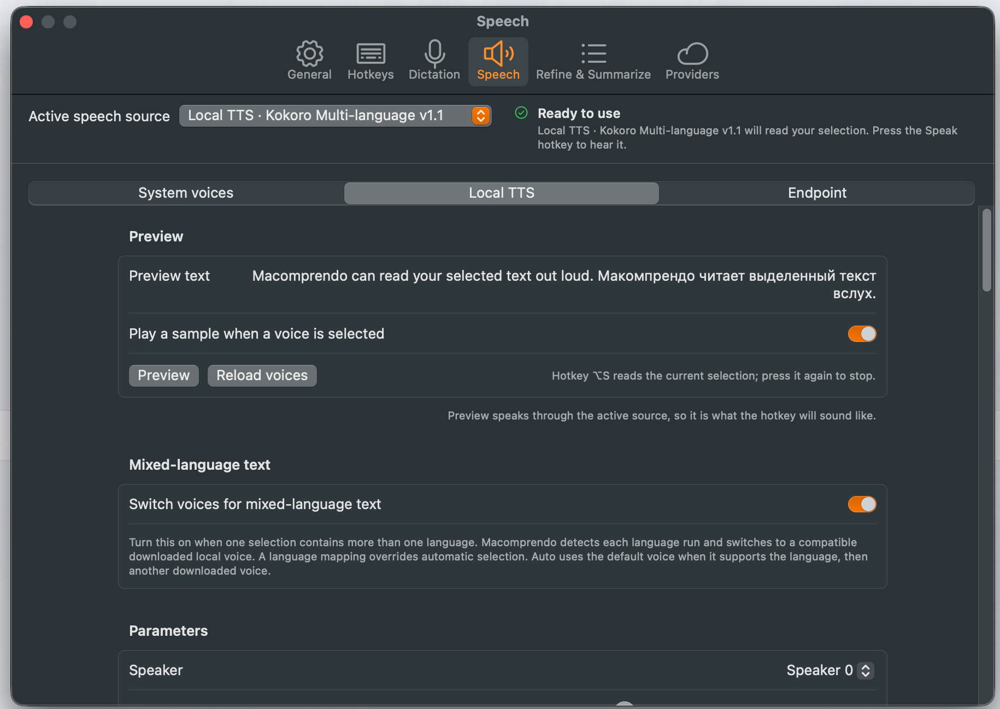
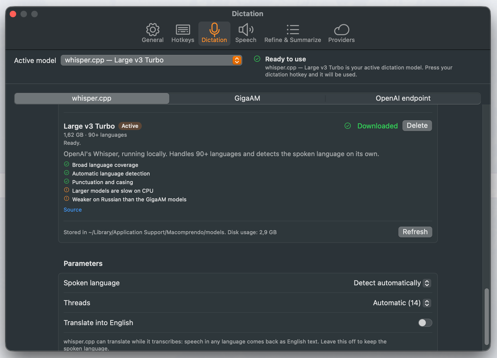
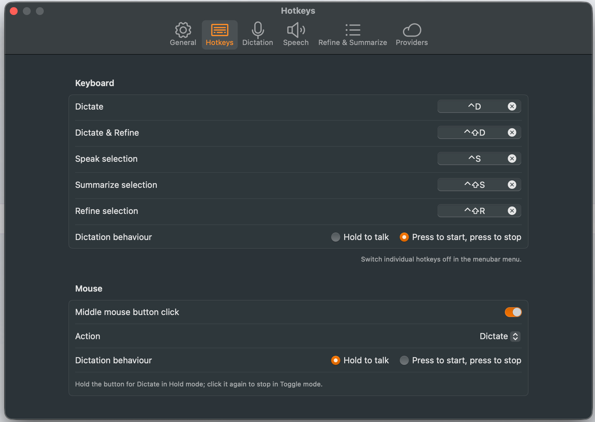

# Macomprendo

A menubar-only macOS app for dictation, reading selected text, refinement, and summarization.
Speech-to-text runs locally with whisper.cpp or GigaAM. Text-to-speech can use macOS voices,
downloaded Piper and Kokoro models, or an OpenAI-compatible endpoint. Refinement and
summarization run through local Ollama or another endpoint you configure.

Macomprendo has no account, telemetry, update ping, or automatic network traffic. It connects
only to services you configure and model downloads you start.

Requires macOS 14 or newer. Universal (Apple silicon and Intel). The source is MIT licensed;
the distributed app is under GPL-3.0 because it bundles a framework with espeak-ng statically
linked — see [NOTICE](NOTICE).



## Features

| Action | Default hotkey | What happens |
|---|---|---|
| **Dictate** | ⌥Space | Records while held (or toggles), transcribes locally, pastes into the frontmost app |
| **Dictate & Refine** | ⌥⇧Space | Same capture, then a Quick Panel with the original and an LLM-refined version side by side |
| **Speak selection** | ⌥S | Reads selected text with System, offline Local, or endpoint speech; System and Local can switch configured voices by language |
| **Summarize selection** | ⌥M | Quick Panel with a streamed summary; Copy or Replace the selection |
| **Refine selection** | unassigned | The refine Quick Panel, applied to the current selection |

Other things it does:

- **Local transcription** with whisper.cpp or GigaAM. Whisper uses Metal and supports models
  from `tiny` through `large-v3-turbo`; GigaAM provides Russian-focused models. Files are
  downloaded on demand and stored in
  `~/Library/Application Support/Macomprendo/models/`.
- **Automatic multi-voice text-to-speech.** Macomprendo detects language runs inside one
  selection and switches to the configured System or downloaded Local voice for each language.
  Mixed English, Russian, and Chinese text can be read without changing the voice by hand.
- **Offline Local TTS** with downloadable Piper voices and the multilingual Kokoro model.
  After download, synthesis stays on the Mac.
- **Remote transcription** through any `/v1/audio/transcriptions` endpoint, if you prefer.
- **Optional local dictation history** for text-only Dictate and Dictate & Refine transcripts,
  browsed newest-first in a paged window and capped at 100,000 entries; audio is never saved.
- **Editable prompt presets** for both refine and summarize: Clean up, Formal, Casual,
  Shorten, Expand, Fix grammar, Translate, Brief, Bullets, TL;DR, and Key actions. You can
  rename, rewrite, reorder, delete, or add to.
- **Multiple endpoints.** Add as many Ollama or OpenAI-compatible providers as you like, test
  the connection from Settings, and pick a different model per feature.

## Screenshots

| Local speech-to-text | Global keyboard and mouse actions |
|---|---|
|  |  |

## Install

Download the ZIP for the version you want from the
[Releases page](https://github.com/DZamataev/macomprendo/releases), expand it, and drag
`Macomprendo.app` to `/Applications`.

The official asset is `Macomprendo-<version>-macos.zip`. It is universal, Developer ID signed,
notarized, and stapled. GitHub Actions builds it from the tagged source commit. Before publishing,
the workflow verifies the final ZIP checksum, extracts that ZIP, checks its structure, signatures,
and architectures, and launches the extracted app. The maintainer does not upload a locally built
application to the release.

The [release workflow](.github/workflows/release.yml), its
[public runs](https://github.com/DZamataev/macomprendo/actions/workflows/release.yml), the tagged
source, and the resulting assets are all visible on GitHub.

Verify the download against the `.sha256` published next to it:

```sh
shasum -a 256 -c Macomprendo-<version>-macos.zip.sha256
```

### Build from source

```sh
git clone https://github.com/DZamataev/macomprendo.git
cd macomprendo
npm ci
npm run install-app
```

`npm run install-app` builds an ad-hoc developer copy for your Mac's architecture and installs it
into `/Applications`. This local build is not an official release asset. See
[DISTRIBUTING.md](DISTRIBUTING.md) for build, signing, and release details.

## First run

Onboarding asks for what it needs, and nothing else:

1. **Microphone** — required for dictation.
2. **Accessibility** — required to read the selected text and to paste into other apps. macOS
   grants this in System Settings → Privacy & Security → Accessibility; the app deep-links you
   there.
3. **A whisper model** — `large-v3-turbo` is recommended by default, `base` if you want
   something small and fast.
4. **Ollama** (optional) — checks whether it is running on `http://localhost:11434`; if not,
   it points you to ollama.com or an OpenAI-compatible endpoint instead. Refine and summarize
   default to Ollama's `qwen2.5:1.5b`, pulled from Settings ▸ Providers.

All hotkeys are rebindable in Settings → Hotkeys.

## Privacy

- **No telemetry.** The app contains no analytics, crash reporting, or update pinging.
- **Audio never leaves your Mac** unless you explicitly select a remote transcription endpoint.
- **Text never leaves your Mac** unless you use Refine or Summarize, which send it to the
  endpoint you configured — your local Ollama by default.
- **API keys live in the Keychain only.** They are never written to settings, logs, or exports.
- **Dictation history is opt-in.** When enabled, it stores text locally in SQLite; disabling
  preserves existing entries and Clear History removes them.
- **Transcripts and LLM output are never logged** at the default log level.
- **The clipboard is restored.** Copy/paste simulation snapshots the pasteboard and puts it
  back 300 ms later, guarded by a change-count check so anything you copied meanwhile survives.

See [PRIVACY.md](PRIVACY.md) for the full statement.

## Documentation

- [docs/ARCHITECTURE.md](docs/ARCHITECTURE.md) — layers, protocols, and how they fit together
- [DISTRIBUTING.md](DISTRIBUTING.md) — signing, notarization, releasing
- [docs/SMOKE_TEST.md](docs/SMOKE_TEST.md) — the manual checklist run before every release
- [docs/adr/](docs/adr/) — architecture decision records
- [CHANGELOG.md](CHANGELOG.md)

## License

Macomprendo's own source is MIT — see [LICENSE](LICENSE). © 2026 Denis Zamataev.

The **distributed application** is under **GPL-3.0**, because it bundles
`SherpaOnnxC.framework` with espeak-ng (GPL-3.0) statically linked into it. Full disclosure,
the component list, and why this is expected to be temporary are in [NOTICE](NOTICE).
